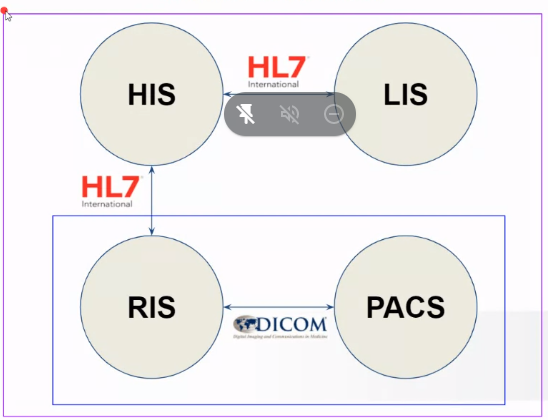
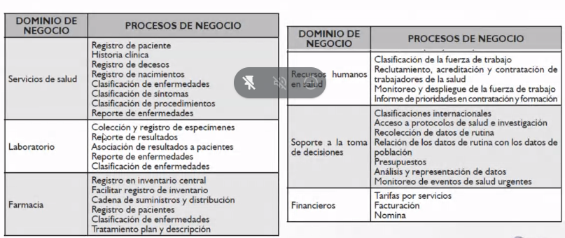
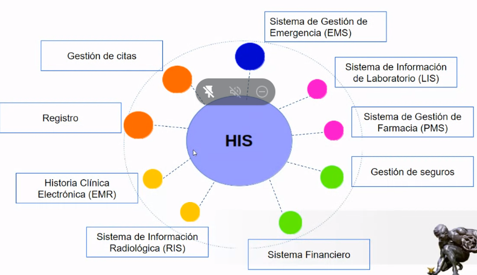
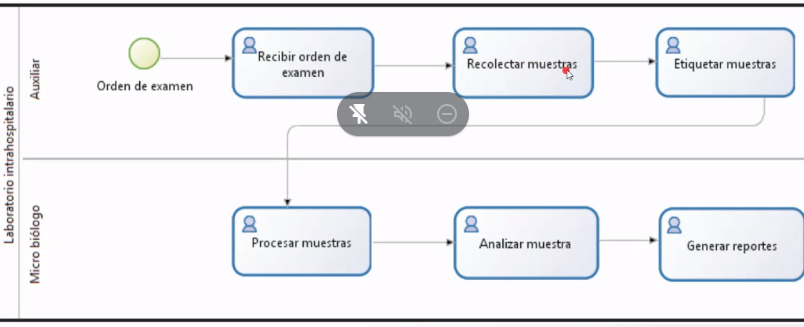
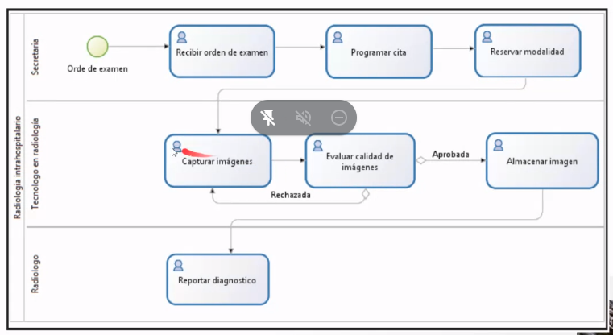
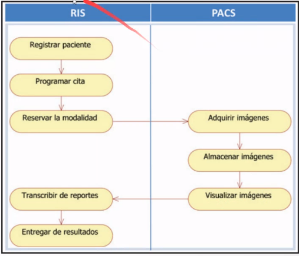

## Sistemas de Información en salud

* Administrativa
* Asistencial 

*Permiten agilizar procesos administrativos, clínicos y  científicos"*

Sin embargo, existen inconvenientes cuando no se sabe cuál es la solución idónea para los problemas de la institución. 

**Sistemas de información asistenciales:**

LIS-HIS-RIS-PACS

En Colombia:
Existen diferentes escenarios (IPS) donde es posible implementar dichos sistemas de información
-  Centros médicos
-  
- 

No solo es tener muchos datos, sino saber *procesar, analizar e interpretar* la información. 

## HIS- Sistema de información hospitalaria

_Objetivo:_
Satisfacer las necesidades de :
- Almacenar
- Procesar
- Interpretar

datos clínicos y administrativos, brindando unas perpectiva general de la institución que ayuda a mejorar la administración de ella y apoya la toma de decisiones.

El principal problema  es la *INTEROPERABILIDAD*

## LIS Sistema de información de Laboratorio Clínico

Son los encargados de automatizar las tareas cotidianas de un laboratorio, estos pueden funcionar como sub-sistemas de un HIS o de manera independiente.

LIMS diferente a LIMS 

Flujo de trabajo del LIS

Retos del LIS:

- Abbott
- mindray
- Roche

Flujo de trabajo en el departamento de Radiología

## RIS Sistemas de información en Radiología

Sistema que controla todo el departamento de diagnóstico por imágenes
- Manejo de turnos
- Stock de insumos
- Facturación del servicio
- Creación y almacenamiento de reportes
- Informes diagnósticos
- Estadísticas

El RIS no está enfocado en la _adquisión, diagnóstico o almacenamiento_ de los estudios.

Su enfoque está centrado en la gestión del departamentos a nivel más alto y tiene la responsabilidad de almacenar los estudios y la gestión de los mismos se delega al PACS

## PACS Sistemas de archivo y comunicación de imágenes

Permite recopilar, analizar, archivar e intercambiar imágenes diagnósticas que se puede tener acceso a ellas en diferentes sitios dentro o fuera de la IPS donde se encuente la modalidad por medio de redes de comunicaciones. 

**Servicios**

- Adquisición de imágenes
- Gestión de imágenes
- Gestión de datos asociados con las imágenes
- Almacenamiento
- Visualización y procesamiento de imágenes
- Impresión de estudios
- Acceso a través de internet- envio vía e-mail.

#### Requerimientos para implementación de PACS 

1. Redes de comunicaciones de alta velocidad
2. Acceso concurrente a los diferentes recursos (Modalidades)

