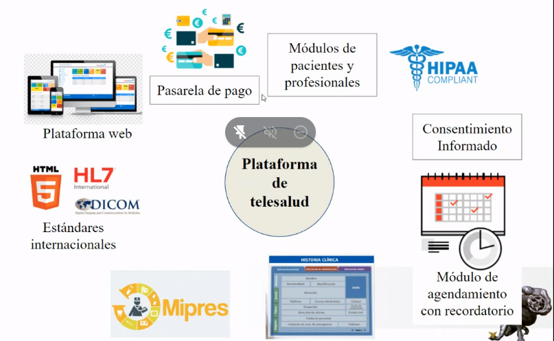
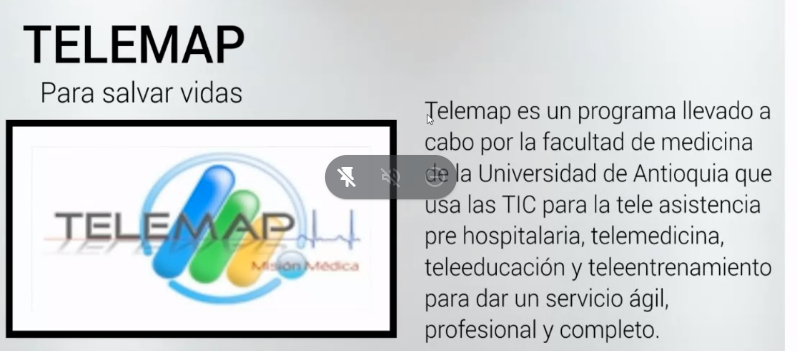
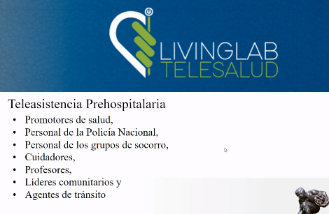

## Telemedicina
Puede ser tan simple como:
- Dos profesionales de la salud discutieno un caso por teléfono.

Hasta
- La utilización de avanzada tecnología en comunicaciones e informática para realizar:
_consultas,diagnósticos o cirugías a distancia y en tiempo real.

**CRONOLOGÍA DE LA MEDICINA**
 IMAGEN

 Según *Medicare.gov...*
 "La Telemedicina busca mejorar la salud de un paciente, permitiendo la comunicación interactiva en tiempo real entre el paciente, y el médico o profesional a distancia. Esta comunicación electrónica conlleva el uso de equipos de telecomunicaciones interactivas que incluyen, como equipamiento mínimo, audio, vídeo."

### La telemedicina incluye:
* Diagnóstico y tratamiento.
* Educación médica.
* Servicios complementarios e instantáneos a la atención hospitalaria.
* Diágnositicos inmediatos por parte de un especialista.
* Servicio de archivo digital de exámenes radiológicos, ecografías y otros.

### Aplicaciones:

- Telediagnósis.
- Teleconsulta.
- Teleradiología.
- Monitorización remota.
- Reuniones médicaspara obtener opiniones.
- Almacenamiento digital de datos o fichas médicas.

### ¿Qué debería tener una plataforma de telesalud?

- Plataforma web
- Estándares internacionales (HL7, HTML5, DICOM)
- Mipres 
- Módulo de agendamiento
- Consentimiento informado
- Módulo de HIPAA Compliant: Seguridad médica
- Módulos de pacientes y profesionales
- Pasarela de pago

# EJEMPLOS:

¡Cuidado en casa!
